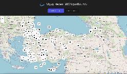

# Flight_Radar

#Merhaba bu projem React Toolkit Thunk kullanılarak oluşturulmuş bir uçuş radarı projesidir. RapidApi'de bulunan Flight-radar apiden alınan verilerle lokasyonu girilen bölge üzerindeki tüm uçuşları canlı olarak göstermektedir. Harita olarak Leaflet kullanılmıştır. Projede bir harita sayfası bir de liste sayfası bulunmaktadır. Uçuşlar hakkındaki tüm detaylara iki sayfadan da ulaşabilirsiniz. 

